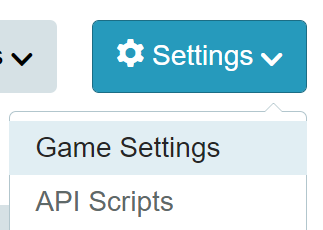
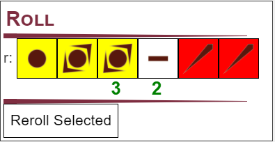
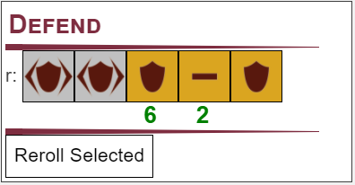
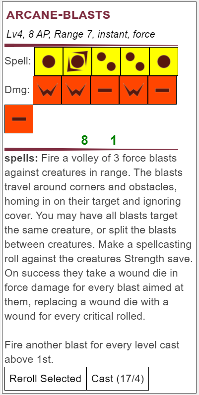
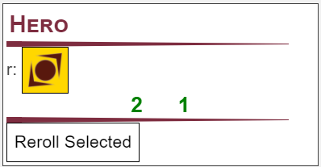

# Roll20 Integration

Here you'll find all the resources you'll need to start a game of Farhome using roll20. Due to using custom character sheets and API scripts, at least one player will need to have a pro subscription to create the game.

## Character Sheet
To use Farhome's Character sheet effectively you'll need a game with both custom character sheets and API scripts enabled. You can add the custom character sheet to your game without the API scripts, however none of the roll buttons will work correctly.

### Adding the Character Sheet to your Game

To add the Farhome character sheet to your game you will need to copy the contents of both [farhome.html](farhome.html) and [farhome.css](farhome.css) to the character sheet boxes in your game's game settings. Open your game settings by clicking Settings -> Game Settings from your game's main page.



Scroll down to your Character Sheet Template and change the setting to 'Custom'. In the HTML Layout box copy the contents of [farhome.html](farhome.html) and in the CSS Styling box copy the contents of [farhome.css](farhome.css).


After saving your settings, any character you create in your game will use the Farhome character sheet.

### Character Sheet Features
While the Farhome sheet does a lot of things for you, you will still want to make abilities for attacks, spells, or other rolls not handled by the sheet. Most sections in the character sheet have a toggle button that collapses or reveals that section. Here's a rundown of what the sheet does handle.

#### Stats
Here you enter your 6 core stats along with their attribute save proficiencies. Clicking the roll button beside each will roll that attribute save. The button beside your healing surges will roll 3 wound dice, but does not automatically heal your character or decrement your healing surges. Setting your Exhaustion field will reduce all of your proficiencies by the correct amount, but does not automatically change your max wounds.

#### Potions
Clicking the roll buttons will roll the wound dice that potion would heal, but does not decrement the potion on your sheet.

#### Proficiencies
Here you'll find every skill, tool, and weapon proficiency. Clicking on the roll button will roll that skill. The checkbox beside each skill is used to denote expertise in that skill. The equipment section has no effect on your rolls, but is there for your reference.

#### Combat and Feats
The roll button beisde your armor will make a defend roll with the given dice. The initiative roll button rolls your initiative and adds your character to the initiative tracker.

The Attacks and Maneuvers section lets you add attacks or maneuvers without needing to use the APIs or abilities. Pressing the roll button will make a roll with the given dice (Superior, Enhanced, Normal, Bad, Terrible, in order) and damage, combined into a single roll.

The Feats section lets you to add feat descriptions to your sheet for easy reference. Adding feats here has no effect on any rolls you make.

The Magic Items section lets you add magic items with their descriptions. Each magic item has a checkbox for attunement and a textbox for charges for ease of tracking.

#### Attributes and Abilities
While not added by this character sheet, the Attributes and Abilities tab is extremely useful. From here you can add abilities, which let you enter in chat macros that directly reference your character sheet. You can make them appear whenever your token is selected by checking the 'Show as Token Action' box.

For example, if you wanted a one-handed attack roll that uses your dexterity instead of your strength, you can create an ability with this command:

```
!skill @{dex} @{1hand}
```

This command will read your Dexterity attribute (the @{dex} tag) and your one-handed proficiency (the @{1hand} tag) when making this roll.

## Roll API
The roll API makes use of roll20's API scripts, and requires your game to have been made by an account that has access to that feature. To add the script to your game you'll want to go to your game's API script settings page, which you can get to from the game's main page and clicking Settings -> API scripts.


Once there, you'll want to add this script to your game. Click on 'New Script', enter a name, and copy paste the code from [rollapi.js](rollapi.js) to the window.


Press 'Save Script', and after a few seconds you should see 'Farhome Dice v1.0 loaded' in the output box below. Congradulations! You should have access to all the commands below. To use a command, launch your game and enter it into the chat window. You can also use these commands by writing it in an ability from your character sheet, or as a macro.

### Roll Icons
If you do not see dice icons when making your rolls you may need to upload the [dice icons provided](../icons). Personally I use imgur to host the images, but any image host should work, as long as you can get a url of the images. Once uploaded, replace the following urls in the script with the urls of the icons you've uploaded:


Save the script and retry your roll. If the image urls are publicly accessable you should see dice icons with your rolls.

### Status Effects
I've also provided a number of status icons. You may use any status icons you wish, however icons with a name of hex1-3, or posion1-3 will have an effect on rolls made by those tokens. For example, making an attack roll while a token with a poison2 status icon is selected will add 2 bad dice to the roll.

## Roll API Documentation
In roll20 all API commands are prefixed with a '!'. For example, roll20's built in dice roller uses the '/r' or '/roll' command, while to roll dice using the roll API you use '!roll'.

Each command needs to reference a character sheet to work. If you have a token selected the API will use the character sheet linked to that token. Otherwise if you have changed the 'As' field in the roll20 chat box, it will use the character sheet associated with that character. If no character sheet can be found the API will give an error.

### Roll
```
!roll <Superior> <Enhanced> <Normal> <Bad> <Terrible>
```

The roll command is used to roll the 5 main dice without any modifiers. It takes 5 numbers as arguments representing how many of each die to roll. In order, it expects: Superior, Enhanced, Normal, Bad, Terrible. All dice values are required, even if you aren't including that die in your roll.

For example, if you wanted to make a roll containing 3 superior dice, 1 normal die, and 2 bad dice you would call:

```
!roll 3 0 1 2 0
```


### Skill
```
!skill <Attribute Score> <Proficiency Score>
```

Given an attribute and proficiency score, the skill API will make a 5 die roll calculated with those values. The Skill command can handle negative attributes and proficiencies, downgrading normal dice to bad and terrible dice. This command is mainly used for making skill rolls, but is useful for any roll based on an attribute.

For example, rolling a stealth check for a character that has 3 dex and 1 stealth proficiency:

```
!skill 3 2
```

Will roll 1 superior die, 2 enhanced dice, and 2 normal dice. Alternatively you can reference these values directly from your character sheet using the '@' notation:

```
!skill @{dex} @{stealth}
```


### Defend
```
!defend <Superior Defense> <Defense>
```

Rolls defense dice based on the two arguments passed. For example, to roll 2 superior defense dice and 3 defense dice you would enter:

```
!defend 2 3
```


### Wound
```
!wound <full wounds> <wound dice>
```

Useful for showing the total damage done by an attack, not just how many wound dice were rolled. The command takes 2 arguments: how many wounds the attack deals (ignoring wound dice), and how many wound dice to roll. 

For example, if you were making an attack that dealt 1 wound and 2 wound dice in damage:

```
!wound 1 2
```


### Spell
```
!spell <spell name> <spell level>
```

This command takes the spell name and level you are casting at. If the spell has spaces in the name, such as _shroud of darkness_, you must replace any space with a '-' character. The command will use the correct attribute based on the spell entered, and will handle any dice added to your roll from upcasting the spell and include a wound roll if the spell does damage.. It will also add the spells text to the roll for reference. The spell command does **not** include any dice added to the spell as noted in its description, such as the 2 superior dice added by _Sleep_ or bad dice added per creature targeted by _Concealment_. To cast as a cantrip enter 0 for the level.

The command adds a button beside the reroll button indicating how much mana you have remaining and how much mana this spell costs to cast. Your characters mana is only updated if you click that button, allowing you to use the spell command as a reference or for repeated effects without changing your mana.

For example, to cast the spell _Arcane Blasts_ at 4th level:

```
!spell arcane-blasts 4
```


### Hero
```
!hero
```

Used to roll a single hero die, useful if your game uses them. Hero dice are immune to anything that would change the roll, such as poison and hex.

The usage is pretty straightforward:

```
!hero
```


### RTMP
```
!rtmp `block1` `block2`..`block3`
```

RTMP, short for roll template, allows you to define your own roll templates. You define templates by passing any number of blocks as arguments for the command. Each block is wrapped in ` (back tick, not apostrophe or quotation marks) and contains a keyword and content separated by a | character (pipe or bar). A full list of keywords is found below.

For example, lets make a roll template for a sword attack, including both the attack and damage roll into a single template:

```
!rtmp `name|Great Sword` `description|5 AP, melee` `roll.Attack|skill @{str} @{1hand}` `roll.Dmg|wound 1 1` `text.effect|Targets a single creature, making a defense save against this roll.`
```


#### Name
```
`name|<text>`
```

Used to change the name of the template. Sets the name to the text given.

#### Description
```
`description|<text>`
```

Changes the subtext below the title of the template. This text appears in an italics in a smaller font, useful for showing the AP cost of a skill, its range, or any other information.

#### roll
```
`roll.<label>|<command>`
```

Used to add a roll with a given title to the template. The command field can be any command string, except spell and rtmp. When entering the command string you do not add the leading '!'. The roll will have a title matching the text in the label field, allowing you to add multiple rolls with different names.

For example, to add a wound roll labeled Damage you would enter:

```
`roll.Damage|wound 1 1`
```

#### text
```
`text.<label>|<text>`
```

Used to add a text field to the template. The text will have a title matching the text in the label field, allowing you to add multiple text fields with different names.

For example, if you wanted to add an 'On Crit' text field to display crit effects you would enter:

```
`text.On Crit|This weapon inflicts Poison 1 on crit.`
```

#### mana
```
`mana|<number>`
```

While mainly used behind the scenes by the spell command, this tag adds a mana button beside the reroll button. When clicked it will spend the given amount of mana from your character. This is useful if you are making homebrew spells, or have a magic item or effect that costs mana.

For example, to add a button that consumes 4 mana when clicked:

```
`mana|4`
```


### Bonus Dice
```
b<tag>-<tag>-..<tag>
```

You may add extra dice to any roll by adding a bonus dice string to the end of the command. Bonus dice strings start with the 'b' character, followed by any number of dice tags separated by a '-' character. Dice tags are followed by a number which tells the command how many of that dice to add to the roll. With this you can add any die to any roll, regardless of the type of dice the roll uses. This means you can add superior dice to defend rolls or wound dice to skill rolls. This can also be used to add flat successes or criticals to your roll.

For example, if I wanted to add 1 superior die and 1 critical to my spell roll:

```
!spell firebolt 1 bs1-cs1
```

To break this down further, lets take a look at the bonus string in the example, 'bs1-cs1'. All bonus strings start with 'b' to let the API know to expect dice tags. We first want to add a superior die to our roll, so we add 's1'. 's' being the dice tag for superior dice and '1' being how many dice we wanted to add. If we wanted to add 3 superior dice you would write 's3'. We want to add a critical as well, so we add the '-' character to let the API know we're adding more tags. Finally we add 'cs1', 'cs' being the dice tag for critical successes and '1' being how many we want to add. This gives us the full string 'bs1-cs1'.

| Dice Tag | Die |
|:----:|:-------------:|
| s  | Superior |
| e | Enhanced |
| n | Normal |
| b | Bad |
| t | Terrible |
| d | Defense |
| sd | Superior Defense |
| gw | Full Wounds (not dice) |
| w | Wound Die |
| h | Hero |
| sc | Successes |
| f | Fails |
| cs | Critical Successes |
| cf | Critical Fails |

### Examples

You can use many of the built in roll20 commands along with the API script commands, allowing you to make some pretty handy macros and abilities. Here's a few examples.

#### Adding a Query to select the level for your spell

Using roll20's query syntax lets you define a set of options to select from whenver you use the command. If we wanted to choose which level to cast our _Firebolt_ spell, you can do something like this:

```
!spell firebolt ?{Level?|0|1|2|3|4|5|6|7|8|9|10}
```

#### Adding dice for each target in a spell

You can use queries and the bonus dice string to handle spells that add dice based on how many targets you choose.

```
!spell charming-guise 1 bb?{Targets?|1,0|2,1|3,2|4,3|5,4}
```

#### Referencing your Characters Attributes

You can reference your characters attributes directly when writing an ability in your character sheet.

```
!skill @{str} @{athletics}
```

Or if pasting to the chat window or from a macro, you can use the attributes from the selected tokens character sheet (Make sure the token is selected before you roll!)

```
!skill @{selected|str} @{selected|athletics}
```